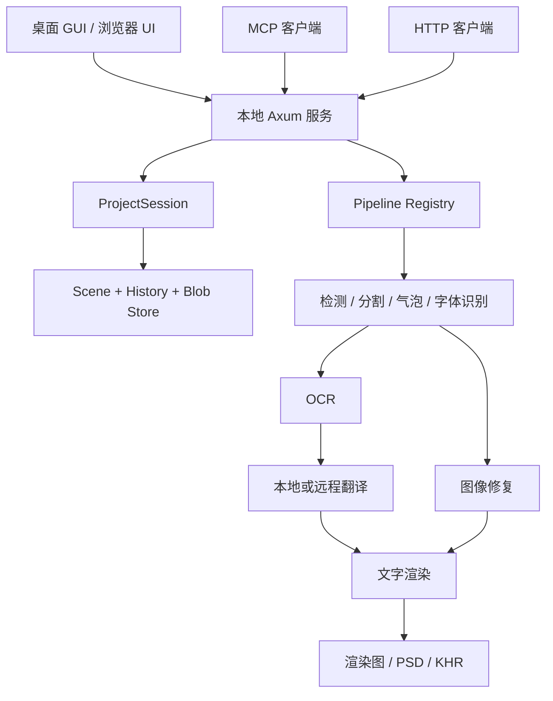
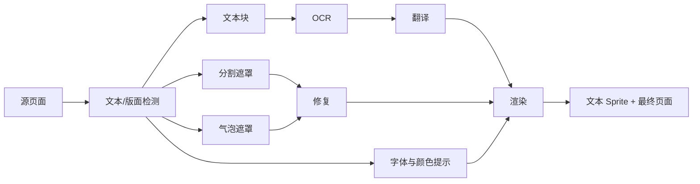

# Koharu 项目功能全景分析

## 文档基线

本文基于以下仓库状态整理：

- Koharu 版本：`0.61.2`
- Git 提交：`430ff6f6`
- 分析日期：2026-07-11
- 许可证：`GPL-3.0-only`

本文以当前源码、配置、OpenAPI、UI 实现和项目内测试为主要证据。模型质量、实际显存消耗、远程提供商可用性和整页生成效果仍需要在完整运行环境中验证。

## 项目定位

Koharu 不是单一的图片翻译脚本，而是一套本地优先的漫画翻译与编辑平台，主要包括：

- Tauri 桌面应用与浏览器 Web UI
- 漫画项目、页面和图层管理
- 文本检测、气泡检测、分割、OCR、翻译、修复和文字渲染流水线
- 本地 GGUF LLM、云端 LLM 和机器翻译服务
- 手工文本块、遮罩、笔刷和排版修正
- PNG、PSD 和 `.khr` 项目归档导出
- HTTP API、SSE 事件流和 MCP 自动化接口
- Codex 整页图像生成

主技术栈是 Rust、Candle、llama.cpp、Axum、Tauri 和 Next.js。版本与许可证定义在根目录 `Cargo.toml`。

## 整体架构与数据流

桌面窗口不会绕过服务层直接调用推理代码。Desktop、Headless、HTTP 和 MCP 共用同一套本地服务、项目会话和流水线状态，入口位于 `crates/koharu/src/app.rs`。

## 启动与运行模式

Koharu 支持三种主要使用形态：

| 模式 | 使用方式 | 适用场景 |
| --- | --- | --- |
| Desktop | 直接运行 `koharu` | 日常可视化编辑 |
| Headless | `koharu --port 4000 --headless` | 浏览器操作、脚本和服务器运行 |
| MCP / API | 固定端口后访问 `/mcp` 或 `/api/v1` | Agent 与自动化集成 |

主要命令行参数：

- `--cpu`：强制使用 CPU
- `--host`：指定监听地址
- `--port`：固定 HTTP 服务端口
- `--headless`：不打开桌面窗口
- `--download`：准备运行时后退出
- `--debug`：输出调试日志

源码中的默认端口行为是：

1. 从端口 `4000` 开始绑定。
2. 发行构建未显式指定端口时，如果端口已占用，则继续尝试更高端口。
3. 显式传入 `--port` 时只绑定指定端口，冲突会直接失败。

参数定义位于 `crates/koharu/src/cli.rs`，启动流程位于 `crates/koharu/src/app.rs`。

## 项目管理

### 用户功能

欢迎页支持：

- 新建项目
- 打开最近项目
- 永久删除项目
- 导入 `.khr` 项目归档

项目保存在 `{data.path}/projects/*.khrproj`，主要包含：

- `project.toml`：项目元数据
- `scene.bin`：场景快照
- `history.log`：持久化操作日志
- `blobs/`：按内容哈希保存的图片和遮罩
- `.lock`：项目独占锁

### 内部流程

1. 新建或打开项目时创建 `ProjectSession`。
2. 项目目录通过 `.lock` 获取独占锁。
3. 加载 `scene.bin` 场景快照。
4. 回放快照之后的 `history.log` 操作。
5. 编辑期间所有修改通过历史层写入日志。
6. 自动保存任务定期把当前状态压缩回 `scene.bin`。

### 使用限制

- 同一项目一次只能被一个 Koharu 会话打开。
- 删除项目会删除页面、图片和翻译，且不可撤销。
- 内存撤销栈默认最多保存 500 项。
- 关闭并重新打开项目后最终状态仍然存在，但上一会话的撤销栈不会恢复。
- 只包含中文等非 ASCII 字符的项目名在生成目录 ID 时可能退化为 `untitled`，显示名称仍保存在项目元数据中。

相关实现位于：

- `crates/koharu-app/src/projects.rs`
- `crates/koharu-app/src/session.rs`
- `crates/koharu-app/src/history.rs`
- `crates/koharu-app/src/autosave.rs`

## 页面导入与管理

### 支持的输入

- `.png`
- `.jpg`
- `.jpeg`
- `.webp`
- `.khr` 项目归档

文件夹导入会递归筛选支持的图片，并按文件名自然排序。

### 用户功能

- 缩略图导航
- Ctrl/Cmd 多选页面
- Shift 连续选择页面
- 批量删除页面
- 拖放调整页面顺序
- 切换当前页面

### 使用限制

- 当前不支持直接导入 PDF、CBZ、CBR 或 PSD 作为源页面。
- 项目至少保留一页，不能删除最后一页。
- 底层 `importPages()` 和 HTTP API 支持追加页面，但当前主菜单只连接了替换页面集合的“打开文件”和“打开文件夹”入口。

前端入口位于：

- `ui/components/WelcomeScreen.tsx`
- `ui/components/Navigator.tsx`
- `ui/components/PageManagerDialog.tsx`
- `ui/lib/io/pagesIo.ts`

## 自动翻译流水线

### 当前默认引擎

| 阶段 | 默认引擎 |
| --- | --- |
| 版面 / 文本检测 | `pp-doclayout-v3` |
| 文本分割 | `comic-text-detector-seg` |
| 气泡分割 | `speech-bubble-segmentation` |
| 字体识别 | `yuzumarker-font-detection` |
| OCR | `paddle-ocr-vl-1.6` |
| 翻译 | `llm` |
| 修复 | `lama-manga` |
| 渲染 | `koharu-renderer` |

默认值定义在 `crates/koharu-app/src/config.rs`。

### 流程

用户可以：

- 分别点击“检测、识别、生成、修补、渲染”
- 处理当前页面
- 处理全部页面
- 自定义选择流水线阶段
- 为一次运行指定目标语言、系统提示词、默认字体和阅读顺序

### 事务与错误处理

- 引擎只返回 `Op`，不会直接修改 Scene。
- 每个引擎、每个页面形成一个可撤销的 `Op::Batch`。
- 后端根据引擎声明的输入和输出 Artifact 构建拓扑执行顺序。
- 某页某一步失败时，该页剩余步骤会被跳过。
- 其他页面仍会继续处理。
- 任务结果会记录 warning 数量，并通过 SSE 发布进度、警告和结束事件。
- 用户可以通过 Operations 接口取消正在运行的流水线。

实现位于 `crates/koharu-app/src/pipeline/` 和 `crates/koharu-rpc/src/routes/pipelines.rs`。

## 文本块编辑

编辑器支持：

- 自动检测文本块
- 手工框选创建文本块
- 单选和多选文本块
- 拖动与调整文本框大小
- 删除文本块
- 手工编辑 OCR 原文
- 手工编辑译文
- 只重新翻译一个文本块
- 从右到左、从左到右或自定义阅读顺序
- 文本块修改后自动重新渲染

### 单块翻译流程

1. 在文本块面板选择目标文本块。
2. 确认 LLM 已加载。
3. 点击该文本块的翻译按钮。
4. 前端只把该 Node ID 传给翻译引擎。
5. 翻译完成后仍以页面为范围重新渲染最终图。

OCR、译文、位置、大小或文本样式修改后，会通过 500 毫秒防抖触发页面 Render。实现位于：

- `ui/components/panels/TextBlocksPanel.tsx`
- `ui/components/canvas/TextBlockLayer.tsx`
- `ui/lib/io/scene.ts`

## LLM 与目标语言

### 支持的后端

Koharu 同一时刻维护一个已加载的翻译目标：

- 一个本地 GGUF 模型；或者
- 一个远程 Provider 模型。

支持的远程 Provider：

- OpenAI
- Gemini
- Claude
- DeepSeek
- DeepL
- Google Cloud Translation
- 彩云
- OpenAI Compatible，例如 LM Studio、OpenRouter、vLLM

### 使用流程

1. 在 Settings > API Keys 配置 Provider。
2. 对 OpenAI Compatible 配置 Base URL。
3. 从画布顶部 LLM 选择器选择模型。
4. 选择该模型支持的目标语言。
5. 点击“加载”。
6. 模型状态变为 Ready 后运行翻译。
7. 不再使用本地模型时点击“卸载”释放内存。

### 语言范围

- `Language` 枚举当前包含 42 种目标语言。
- 模型选择器会按照当前模型或 Provider 的语言目录过滤选项。
- 彩云当前只支持其中 17 种语言。
- 目标语言属于单次流水线运行参数。
- 一次运行只能生成一种目标语言，多语言输出需要分别运行多次。
- 未传入或无法解析目标语言时，翻译层回退到英语。

### 数据边界

- 使用普通远程 LLM 或机器翻译 Provider 时，发送的是 OCR 文本。
- 页面原图不会发送给普通翻译 Provider。
- Codex 整页图像生成功能是例外，会上传完整页面。

实现位于：

- `crates/koharu-app/src/llm.rs`
- `crates/koharu-llm/src/language.rs`
- `crates/koharu-llm/src/providers/`

## 图像修复与笔刷

### 工具

- 选择工具
- 文本块工具
- 彩色笔刷
- 橡皮擦
- 修复笔刷
- 8–128 px 笔刷大小
- 笔刷颜色选择

### 修复笔刷流程

1. 切换到修复笔刷时自动显示分割遮罩和修复图层。
2. 白色笔刷增加需要修复的区域。
3. 橡皮擦从分割遮罩移除区域。
4. 笔画结束后上传完整 PNG 遮罩。
5. 请求携带当前修复引擎和笔画边界区域。
6. 后端同步执行局部修复。
7. 遮罩更新和修复结果组成同一个历史批次。

普通彩色笔刷写入独立的 `brushInpaint` 图层。渲染器合成顺序是：

1. 修复图
2. 笔刷层
3. 各文本 Sprite

### 使用限制

- 普通笔刷修改不会自动触发 Render。
- 若修改笔刷后直接导出已有 Rendered 图层，可能得到修改前的旧结果。
- 导出扁平图之前应手动重新运行 Render。
- PSD 会把笔刷作为独立辅助层保留。

相关实现位于：

- `ui/hooks/useMaskDrawing.ts`
- `ui/hooks/useRenderBrushDrawing.ts`
- `crates/koharu-rpc/src/routes/pages.rs`
- `crates/koharu-app/src/pipeline/engines/renderer.rs`

## 图层查看

用户可以独立显示或隐藏：

- 原始图像
- 分割遮罩
- 修复图像
- 笔刷层
- 文本块边框
- 最终渲染图

图层面板主要控制前端显示状态，不等同于删除对应 Scene 数据。实现位于 `ui/components/panels/LayersPanel.tsx`。

## 字体与文字渲染

### 功能

- 系统字体扫描
- 按需下载和缓存 Google Fonts
- 字体家族与字重/斜体变体
- 收藏字体
- 全局默认字体
- 单个或多个文本块字体覆盖
- 字号、颜色、粗体、斜体
- 左、中、右对齐
- 描边开关、颜色和宽度
- 字体、文字颜色和描边预测
- 自动适配气泡
- CJK 纵排
- RTL 脚本
- 字体回退和 emoji/符号回退

### 渲染流程

1. 规范化译文和样式。
2. 根据脚本与文本框几何选择横排或纵排。
3. 选择主字体和回退字体。
4. 使用 ICU4X 断行。
5. 使用 HarfBuzz/harfrust 整形。
6. 纵排模式启用 `vert` 和 `vrt2` OpenType 特性。
7. 计算真实字形 ink bounds。
8. 使用 tiny-skia 栅格化。
9. 合成到修复页面。

### 使用限制

- 纵排判断依赖“包含 CJK 且文本框高于宽”的启发式。
- CJK 换行尚未实现完整漫画禁则处理。
- 不支持 ruby、warichu 等专业出版排版能力。
- 字体本身缺少纵排字形时无法由渲染器补齐。
- 译文过长仍需人工缩写或调整文本框。

相关实现位于：

- `crates/koharu-app/src/renderer.rs`
- `crates/koharu-renderer/src/layout.rs`
- `crates/koharu-renderer/src/shape.rs`
- `crates/koharu-renderer/src/segment.rs`
- `crates/koharu-renderer/src/text/script.rs`

## 导出

### 支持的格式

| 格式 | 内容 |
| --- | --- |
| `.khr` | 完整项目归档，不包含缓存和锁文件 |
| Rendered | 最终扁平渲染图 |
| Inpainted | 去字但未重新排字的图像 |
| PSD | 原图、遮罩、修复图、笔刷、可编辑文本和合成结果 |

### 导出流程

1. 导出前压缩当前项目快照。
2. 解析用户选择的页面集合。
3. 单页导出直接返回文件。
4. 多页导出打包为 ZIP。
5. 前端根据 `Content-Disposition` 选择真实文件名。

### 使用限制

- Rendered 和 Inpainted 当前统一重新编码为 PNG。
- 页面必须已经生成请求的图层，否则导出失败。
- `.khr` 归档不会包含 `cache/` 和 `.lock`。
- PSD 使用传统 PSD 而不是 PSB。
- PSD 最大支持 `30000 × 30000` 页面。
- Custom 图像节点没有独立 PSD 槽位，只会进入最终合成结果。
- Bubble Mask 仅用于布局，不作为独立 PSD 图层导出。

实现位于：

- `crates/koharu-app/src/archive.rs`
- `crates/koharu-rpc/src/routes/projects.rs`
- `crates/koharu-rpc/src/psd_export.rs`
- `crates/koharu-psd/`

## Codex 整页图像生成

Codex 图像生成功能与本地分阶段翻译流水线相互独立。

### 使用流程

1. 打开 Settings > AI。
2. 使用设备码登录 ChatGPT Codex 账号。
3. 账号必须预先启用双重身份验证。
4. 打开页面右侧 AI 面板。
5. 输入模型名和整页转换提示词。
6. 点击 Generate。
7. Koharu 将源页面编码后发送给 Codex。
8. 返回图像写入当前页面的 Rendered 图层。

当前 UI 默认模型字段为 `gpt-5.5`，生成质量为 `high`，模型字段允许手工修改。

### 使用限制

- 必须联网。
- 依赖 ChatGPT/Codex 账号权限和上游服务状态。
- 设备码登录要求账号启用双重身份验证。
- 会上传完整页面和提示词。
- 结果是整页生成图，无法像本地流水线一样分别控制 OCR、遮罩、字体和可编辑译文。

实现位于：

- `ui/components/SettingsDialog.tsx`
- `ui/components/panels/AiPanel.tsx`
- `crates/koharu-app/src/ai.rs`
- `crates/koharu-ai/src/codex/`

## HTTP API、事件与 MCP

### HTTP API

HTTP API 位于 `/api/v1`。当前 `ui/openapi.json` 包含 36 个路径和 97 个 schema，覆盖：

- 项目和页面
- Scene 和 Blob
- 历史操作
- 流水线
- Operations 和取消
- 模型下载
- LLM 生命周期
- Provider 配置
- 字体和 Google Fonts
- Codex 认证与生成
- 导出

### SSE 事件流

事件流位于 `GET /api/v1/events`，主要事件包括：

- `Snapshot`
- `JobStarted`
- `JobProgress`
- `JobWarning`
- `JobFinished`
- `DownloadProgress`
- `ConfigChanged`
- `LlmLoaded`
- `LlmUnloaded`
- `SceneAdvanced`

客户端断线重连时可以通过 `Last-Event-ID` 回放仍在环形缓冲区中的事件；过旧事件会退化为完整 Snapshot。

### MCP

MCP 位于 `/mcp`，当前暴露：

- `koharu.apply`
- `koharu.undo`
- `koharu.redo`
- `koharu.open_project`
- `koharu.close_project`
- `koharu.start_pipeline`

MCP 当前是刻意保持精简的底层接口。以下功能仍需直接使用 HTTP API：

- 场景快照查询
- 页面缩略图
- Blob 和图层读取
- 字体查询
- 导出
- SSE 任务进度

## 设置与持久化

当前源码实际包含 7 个设置区域：

1. Appearance
2. Engines
3. API Keys
4. AI
5. Keybinds
6. Runtime
7. About

设置分别保存在：

- `config.toml`：数据目录、HTTP、流水线和 Provider Base URL
- 系统 keyring：macOS 和 Windows 的 API key
- Linux 本地凭据文件：依赖仅所有者文件权限，不是系统级加密
- 前端 preferences：主题、UI 语言、默认字体、快捷键、自定义流水线和提示词

Runtime 设置在启动时加载，因此修改数据目录、HTTP 连接超时、读取超时和重试次数后需要重启。Headless 浏览器环境无法自动重启桌面进程。

## UI 本地化

当前 UI 包含 9 种语言：

- `en-US`
- `zh-CN`
- `zh-TW`
- `ja-JP`
- `ru-RU`
- `es-ES`
- `tr-TR`
- `ko-KR`
- `pt-BR`

除英语和韩语外，其余语言缺少部分新增 AI/Codex 文案。简体中文相对英语基准缺少 33 个翻译键，会根据 i18next 配置回退显示英文。

## 硬件、平台和网络限制

### 平台与构建

- 预构建目标：Windows、macOS、Linux
- 源码构建要求 Rust 1.95+
- 源码构建要求 Bun 1.0+
- Windows 默认源码构建路径还需要 Visual Studio C++ 工具链和 CUDA Toolkit

### 加速

- NVIDIA CUDA 要求计算能力 8.0+
- 视觉 CUDA 路径要求驱动支持 CUDA 13.0+
- Windows 本地 LLM CUDA 路径要求 CUDA 13.1+
- Apple Silicon 使用 Metal
- Windows/Linux 的 Vulkan 主要用于 OCR 和本地 LLM
- 检测与修复主要依赖 CUDA 或 Metal
- 所有平台都可以回退到 CPU

### 资源与网络

- CPU 模式下大型 OCR、修复和 LLM 会明显变慢。
- 首次运行需要下载运行时和默认模型。
- 本地模型需要足够的磁盘、RAM 和 VRAM。
- Google Fonts、Hugging Face、远程 Provider 和 Codex 依赖网络。
- 离线使用前应先完成运行时、视觉模型和目标本地 LLM 下载。

## 安全与许可证限制

- HTTP API 没有内置鉴权。
- CORS 使用宽松模式。
- 默认绑定 `127.0.0.1`；使用 `--host 0.0.0.0` 时必须自行配置防火墙、反向代理和访问控制。
- API 单请求体限制为 1 GiB。
- 普通远程翻译服务会接收 OCR 文本。
- Codex 整页生成功能会接收完整页面。
- 项目采用 `GPL-3.0-only`，分发修改版本时需要遵守 GPL v3 的相应开源义务。

## 当前代码与中文文档的不一致

以下差异以当前源码为准：

1. `docs/zh-CN/reference/settings.md` 仍写 6 个设置页签，源码已经是 7 个，新增 AI/Codex。
2. 中文文档称默认检测器为 Comic Text & Bubble Detector，源码默认是 PP-DocLayout V3。
3. 中文文档称默认 OCR 为 PaddleOCR-VL 1.5，源码当前是 1.6。
4. 中文文档称默认修复器为 AOT，源码当前是 Lama Manga。
5. 文档称未指定端口时随机选择，源码实际从 4000 开始顺延。
6. 菜单“重新修补并渲染”实际只启动 inpainter，没有启动 renderer。
7. 文档称渲染导出尽量沿用原始扩展名，源码当前统一导出 PNG。
8. 文档描述可追加文件和文件夹，但当前主菜单只暴露替换导入。

## 验证状态

分析期间完成的静态验证：

- `cargo fmt --all -- --check`：通过
- 所有 locale JSON：解析通过
- `ui/openapi.json`：解析通过
- OpenAPI 路径数：36
- OpenAPI schema 数：97

未能执行的动态测试：

- UI Vitest：本地未安装 UI 依赖，`vitest` 命令不存在
- Rust 单元测试：本地缺少 `cmake`，`libz-sys` 在进入测试前构建失败

因此，本文对源码结构、入口、配置和数据流的描述为高置信度；运行时性能、模型质量、外部服务可用性和不同硬件组合下的行为仍需在完整环境中验证。

## 主要证据文件

- `Cargo.toml`
- `crates/koharu/src/app.rs`
- `crates/koharu/src/cli.rs`
- `crates/koharu-app/src/config.rs`
- `crates/koharu-app/src/session.rs`
- `crates/koharu-app/src/history.rs`
- `crates/koharu-app/src/autosave.rs`
- `crates/koharu-app/src/llm.rs`
- `crates/koharu-app/src/pipeline/`
- `crates/koharu-app/src/renderer.rs`
- `crates/koharu-rpc/src/api.rs`
- `crates/koharu-rpc/src/routes/`
- `crates/koharu-rpc/src/mcp/mod.rs`
- `ui/components/MenuBar.tsx`
- `ui/components/SettingsDialog.tsx`
- `ui/components/canvas/`
- `ui/components/panels/`
- `ui/openapi.json`
